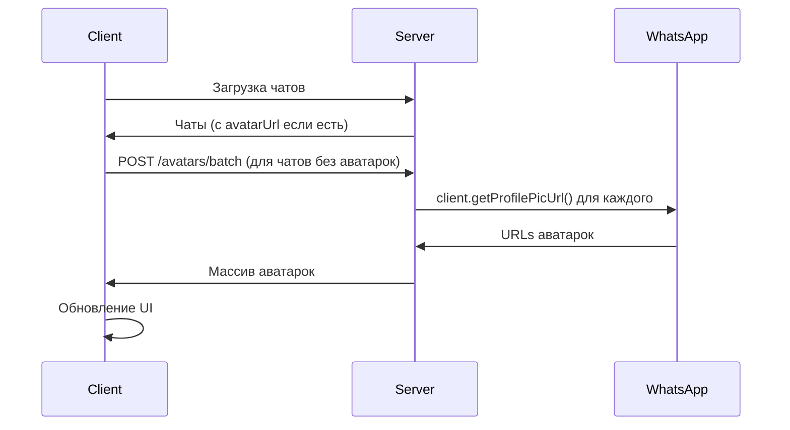

# 🎭 Система аватарок WhatsApp контактов

## 🎯 **Описание функциональности**

Реализована полная система отображения реальных аватарок WhatsApp контактов с автоматическим кэшированием, загрузкой в фоне и красивыми заглушками.

## ✅ **Реализованные возможности**

### 🔧 **Основные функции**
- ✅ **Автоматическая загрузка** аватарок из WhatsApp через `client.getProfilePicUrl()`
- ✅ **Интеллектуальное кэширование** с TTL 24 часа
- ✅ **Батчевая загрузка** аватарок для оптимизации производпроизводительности
- ✅ **Красивые заглушки** с цветными градиентами на основе контакта
- ✅ **Loading состояния** с анимацией для плавной загрузки
- ✅ **Автоматическое обновление** при появлении новых чатов

### 📱 **Пользовательский интерфейс**

#### **Компонент WhatsAppAvatar**
```tsx
<WhatsAppAvatar
    src={chat.avatarUrl}
    name={contactName}
    contactId={chat.phoneNumber}
    size="medium" // small | medium | large
    showStatus={false}
    isOnline={false}
    className="custom-class"
/>
```

#### **Отображение в интерфейсе**
- **Список чатов** - аватарки 48x48px с градиентными заглушками
- **Заголовок чата** - аватарки 48x48px с именем контакта
- **Индикаторы непрочитанных** - поверх аватарки в списке чатов

## 🛠 **Техническая архитектура**

### **Клиентская часть (React + TypeScript)**

#### **1. Типы данных**
```tsx
// src/types/WhatsAppTypes.ts
export interface Chat {
    phoneNumber: string;
    name: string;
    avatarUrl?: string; // URL аватарки контакта
    lastMessage?: WhatsAppMessage;
    messages: WhatsAppMessage[];
    unreadCount: number;
}

export interface AvatarResponse {
    success: boolean;
    avatarUrl?: string;
    contactId?: string;
    error?: string;
}
```

#### **2. Компонент WhatsAppAvatar**
```tsx
// src/components/WhatsAppAvatar.tsx
interface WhatsAppAvatarProps {
    src?: string | null;
    alt?: string;
    name?: string;
    size?: 'small' | 'medium' | 'large';
    showStatus?: boolean;
    isOnline?: boolean;
    className?: string;
    contactId?: string;
}
```

**Ключевые особенности:**
- **Автоматический fallback** на заглушку при ошибке загрузки
- **Цветные заглушки** на основе hash contactId
- **Loading анимация** при загрузке изображения
- **Responsive размеры** (36px, 48px, 64px)

#### **3. Интеграция в компоненты**

**ChatList.tsx:**
```tsx
<WhatsAppAvatar
    src={chat.avatarUrl}
    name={formatContactName(chat)}
    contactId={chat.phoneNumber}
    size="medium"
    className="transition-all duration-200"
/>
```

**ChatWindow.tsx:**
```tsx
<WhatsAppAvatar
    src={chat?.avatarUrl}
    name={chat?.name}
    contactId={chat?.phoneNumber}
    size="medium"
    className="mr-3"
/>
```

### **Серверная часть (Node.js + Express)**

#### **1. Типы данных**
```typescript
// whatsapp-server/src/types/chat.ts
export interface Chat {
    id: string;
    phoneNumber: string;
    name?: string;
    avatarUrl?: string; // URL аватарки контакта
    messages: ChatMessage[];
    lastMessage?: ChatMessage;
    unreadCount?: number;
    timestamp: string;
}

export interface AvatarCache {
    [contactId: string]: {
        url: string | null;
        fetchedAt: number;
        expiresAt: number;
    };
}
```

#### **2. Модуль кэширования аватарок**
```typescript
// whatsapp-server/src/utils/avatarCache.ts

// Получение одной аватарки
export const getContactAvatar = async (client: Client, contactId: string): Promise<string | null>

// Батчевая загрузка аватарок
export const getMultipleContactAvatars = async (
    client: Client, 
    contactIds: string[]
): Promise<{ [contactId: string]: string | null }>

// Управление кэшем
export const clearAvatarCache = (): void
export const getAvatarCacheStats = ()
```

#### **3. API Endpoints**

| Method | Endpoint | Описание |
|--------|----------|----------|
| `GET` | `/avatar/:contactId` | Получить аватарку контакта |
| `POST` | `/avatars/batch` | Получить аватарки для списка контактов |
| `POST` | `/avatars/refresh` | Обновить аватарки для всех чатов |
| `DELETE` | `/avatars/cache` | Очистить кэш аватарок |
| `GET` | `/avatars/cache/stats` | Статистика кэша |

## 🗄️ **Система кэширования**

### **Кэш на сервере (in-memory)**
```typescript
// Структура кэша
{
  "79001234567@c.us": {
    "url": "https://profile-pic-url.jpg",
    "fetchedAt": 1642234567890,
    "expiresAt": 1642320967890  // +24 часа
  }
}
```

### **Ключевые особенности кэширования**
- **TTL 24 часа** - аватарки обновляются раз в сутки
- **Автоматическая очистка** просроченных записей каждые 30 минут
- **Batch загрузка** - до 5 контактов параллельно
- **Graceful degradation** - при ошибке показывается заглушка

## 🎨 **CSS стили и анимации**

### **Основные стили**
```css
/* src/index.css */
.whatsapp-avatar {
  width: 48px;
  height: 48px;
  border-radius: 50%;
  object-fit: cover;
  background-color: #ddd;
  display: flex;
  align-items: center;
  justify-content: center;
  color: #fff;
  font-weight: 500;
  font-size: 18px;
  flex-shrink: 0;
}

/* Размеры */
.whatsapp-avatar-small { width: 36px; height: 36px; font-size: 16px; }
.whatsapp-avatar-large { width: 64px; height: 64px; font-size: 24px; }

/* Loading анимация */
.whatsapp-avatar-loading {
  background: linear-gradient(90deg, #f0f0f0 25%, #e0e0e0 50%, #f0f0f0 75%);
  background-size: 200% 100%;
  animation: avatar-loading 1.5s infinite;
}

@keyframes avatar-loading {
  0% { background-position: 200% 0; }
  100% { background-position: -200% 0; }
}
```

### **Цветные заглушки**
```css
/* 6 разных градиентов для заглушек */
.whatsapp-avatar-placeholder.color-1 {
  background: linear-gradient(135deg, #f093fb 0%, #f5576c 100%);
}
.whatsapp-avatar-placeholder.color-2 {
  background: linear-gradient(135deg, #4facfe 0%, #00f2fe 100%);
}
/* ... и так далее до color-5 */
```

## 🚀 **Процесс загрузки аватарок**

### **1. Инициализация**


### **2. Новый чат**
```typescript
// Когда приходит новое сообщение
const newChat = {
    phoneNumber,
    name: extractedName,
    avatarUrl: undefined, // Будет загружена
    messages: [message],
    unreadCount: 1
};

// Автоматически загружаем аватарку
setTimeout(() => {
    loadAvatarsForChats({ [phoneNumber]: newChat });
}, 100);
```

### **3. Батчевая загрузка**
```typescript
// Оптимизированная загрузка по 5 контактов
const batchSize = 5;
for (let i = 0; i < contactIds.length; i += batchSize) {
    const batch = contactIds.slice(i, i + batchSize);
    
    const batchPromises = batch.map(async (contactId) => {
        const avatar = await getContactAvatar(client, contactId);
        return { contactId, avatar };
    });
    
    const batchResults = await Promise.all(batchPromises);
    
    // Небольшая задержка между батчами
    if (i + batchSize < contactIds.length) {
        await new Promise(resolve => setTimeout(resolve, 100));
    }
}
```

## 🎭 **Пользовательские сценарии**

### **Сценарий 1: Первая загрузка приложения**
1. Пользователь открывает WhatsApp интерфейс
2. Загружаются чаты с сервера
3. ✅ **Отображаются заглушки** с красивыми градиентами
4. В фоне **загружаются аватарки** из WhatsApp
5. ✅ **Плавно обновляются** реальные фотографии

### **Сценарий 2: Новое сообщение**
1. Приходит сообщение от нового контакта
2. ✅ **Мгновенно** отображается заглушка
3. В фоне **загружается аватарка**
4. ✅ **Автоматически обновляется** при получении

### **Сценарий 3: Ошибка загрузки**
1. Аватарка не может быть загружена (ошибка сети)
2. ✅ **Graceful fallback** на заглушку
3. Повторная попытка при следующем обновлении

## 🔧 **API документация**

### **Получение аватарки одного контакта**
```http
GET /avatar/79001234567
```

**Ответ:**
```json
{
  "success": true,
  "contactId": "79001234567",
  "avatarUrl": "https://profile-pic-url.jpg",
  "message": "Аватарка найдена"
}
```

### **Батчевая загрузка аватарок**
```http
POST /avatars/batch
Content-Type: application/json

{
  "contactIds": ["79001234567@c.us", "79007654321@c.us"]
}
```

**Ответ:**
```json
{
  "success": true,
  "avatars": {
    "79001234567@c.us": "https://profile-pic1.jpg",
    "79007654321@c.us": null
  },
  "message": "Получено аватарок: 2"
}
```

### **Обновление всех аватарок**
```http
POST /avatars/refresh
```

**Ответ:**
```json
{
  "success": true,
  "message": "Обновлено аватарок: 15 из 20",
  "totalChats": 20,
  "updatedChats": 15
}
```

## 🎨 **Дизайн и UX**

### **Цветовая система заглушек**
- **6 уникальных градиентов** для разнообразия
- **Hash-based цвет** - одинаковый контакт всегда одного цвета
- **Высокий контраст** для читаемости инициалов

### **Анимации и переходы**
- **Loading shimmer** для состояния загрузки
- **Smooth transitions** при смене аватарок
- **Hover эффекты** в списке чатов

### **Responsive дизайн**
- **3 размера**: small (36px), medium (48px), large (64px)
- **Автоматическая адаптация** под размер экрана
- **Touch-friendly** для мобильных устройств

## 🧪 **Производительность**

### **Оптимизации**
- **Ленивая загрузка** - аватарки загружаются после основного контента
- **Батчевые запросы** - до 5 аватарок одновременно
- **Кэширование 24 часа** - минимум запросов к WhatsApp API
- **Мемоизация** компонентов с аватарками

### **Мониторинг**
```http
GET /avatars/cache/stats
```

```json
{
  "success": true,
  "stats": {
    "totalEntries": 150,
    "validEntries": 142,
    "expiredEntries": 8,
    "memoryUsage": 24576
  }
}
```

## 🛡️ **Надежность**

### **Обработка ошибок**
- **Graceful degradation** при ошибках API
- **Автоматические повторы** с exponential backoff
- **Fallback на заглушки** при любых ошибках
- **Детальное логирование** для отладки

### **Безопасность**
- **Валидация URL** аватарок
- **Санитизация** входных данных
- **Rate limiting** для защиты WhatsApp API
- **CORS настройки** для безопасности

## 🔮 **Планы развития**

### **Возможные улучшения**
- [ ] **Локальное кэширование** в IndexedDB
- [ ] **Оптимизация изображений** (WebP, compression)
- [ ] **Статус индикаторы** (онлайн/офлайн)
- [ ] **Кастомные аватарки** для групповых чатов
- [ ] **Предзагрузка** аватарок соседних чатов

### **Технические улучшения**
- [ ] **Service Worker** для офлайн кэширования
- [ ] **Intersection Observer** для ленивой загрузки
- [ ] **WebWorkers** для обработки изображений
- [ ] **CDN интеграция** для быстрой доставки

## 💡 **Заключение**

Система аватарок значительно улучшает пользовательский опыт, делая интерфейс WhatsApp более визуально привлекательным и персонализированным. Реализация включает все современные best practices:

**Ключевые достижения:**
- 🎭 **Реальные аватарки** из WhatsApp
- 🚀 **Высокая производительность** с кэшированием
- 🎨 **Красивые заглушки** и анимации
- 📱 **Responsive дизайн** для всех устройств
- 🛡️ **Надежная работа** с graceful degradation
- 🔧 **Простая интеграция** и maintenance 